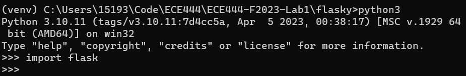
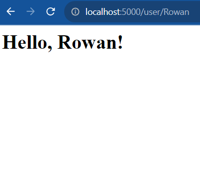
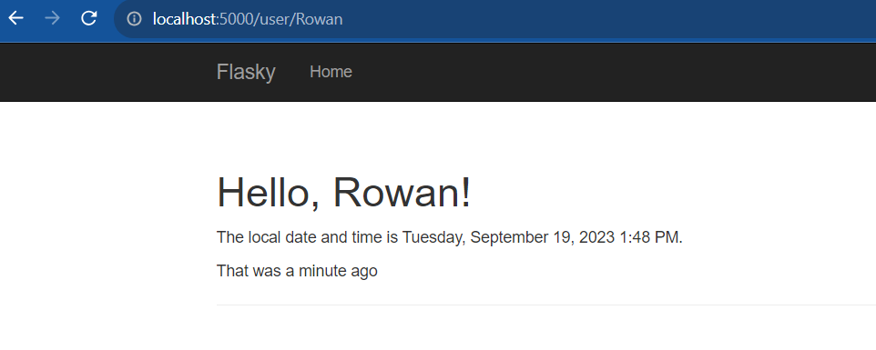
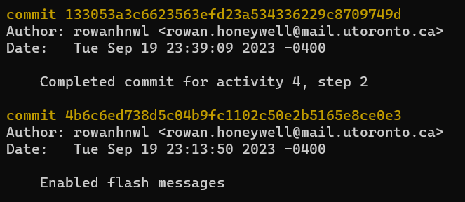
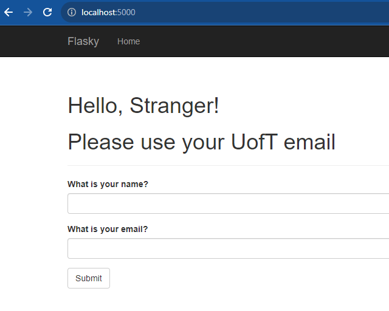
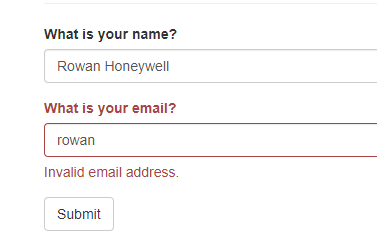
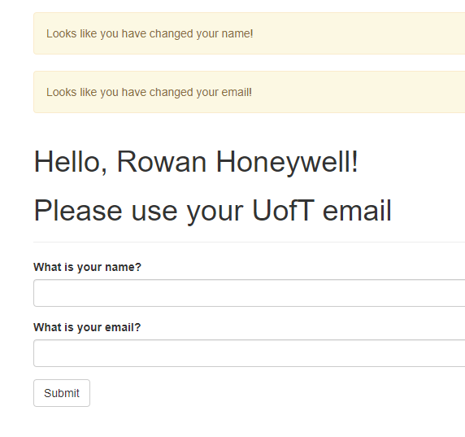

# **Lab 1 - Rowan Honeywell - 1007972945** #

## **Activity 1** ##

### **Importing Flask:** ###

## **Activity 2** ##

This repo is a clone of https://github.com/miguelgrinberg/flasky

### **Example 2-2:** ###

## **Activity 3** ##

### **Chapter 3 examples result:** ###

## **Activity 4** ##

### **Commits from `git log`:** ###

### **Step 2 - Empty form:** ###

### **Step 3 - First name & email:** ###

### **Step 4 - Invalid email:** ###

### **Step 5 - Non UofT email:** ###

